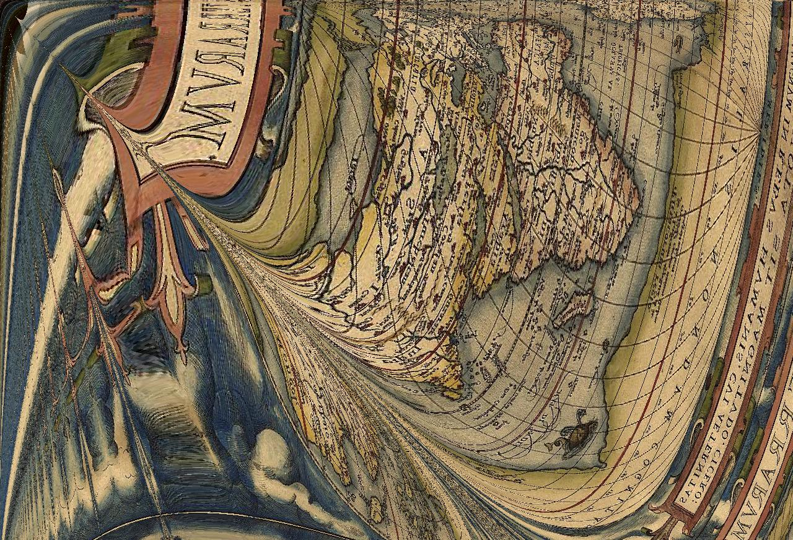
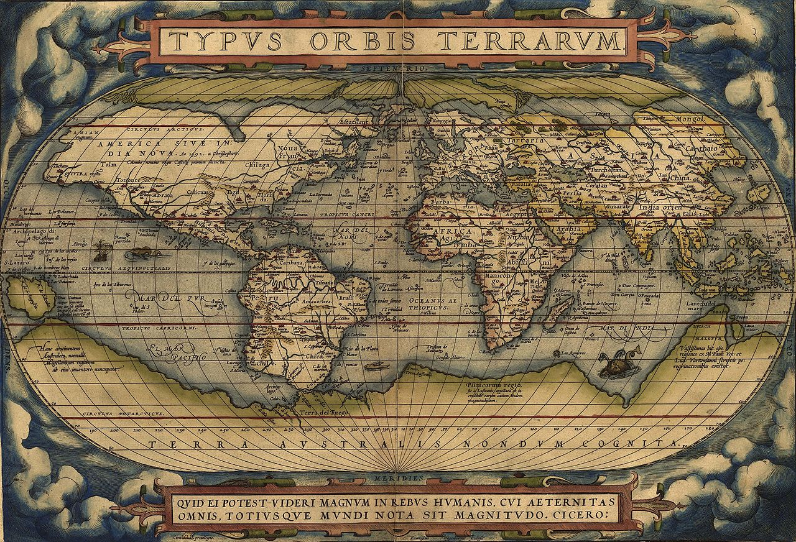

# AutoDistortion


Distortion of images using randomly-generated functions.



This was generated using AutoDistortion from the following image ([Sourced from here](https://upload.wikimedia.org/wikipedia/commons/thumb/e/e2/OrteliusWorldMap1570.jpg/1280px-OrteliusWorldMap1570.jpg))



To run AutoDistortion on an image, download one of the [releases](https://github.com/pommicket/autodistortion/releases), and run the executable. You will be prompted for the name of the image file.

Only PNG and JPG images are supported so far.

## Building AutoDistortion from source

To build AutoDistortion, simply run

```bash
go get github.com/pommicket/autodistortion
cd $GOPATH/github.com/pommicket/autodistortion
mkdir -p bin
go build -o bin/autodistortion
```

## Arguments

You can see a list of command line arguments using
```bash
autodistortion -help
```

These include:

- `-in`, `-out` - Set the input and output files respectively
- `-seed` - Sets the seed for the random number generator (default to the time in nanoseconds). This is useful for distorting multiple images with the same distortion.
- `-threads` - Sets the number of threads to use (defaults to 64)

## License

AutoDistortion is licensed under the [GNU General Public License, Version 3](https://www.gnu.org/licenses/gpl-3.0.html).